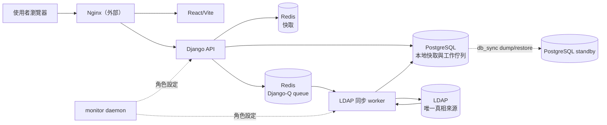
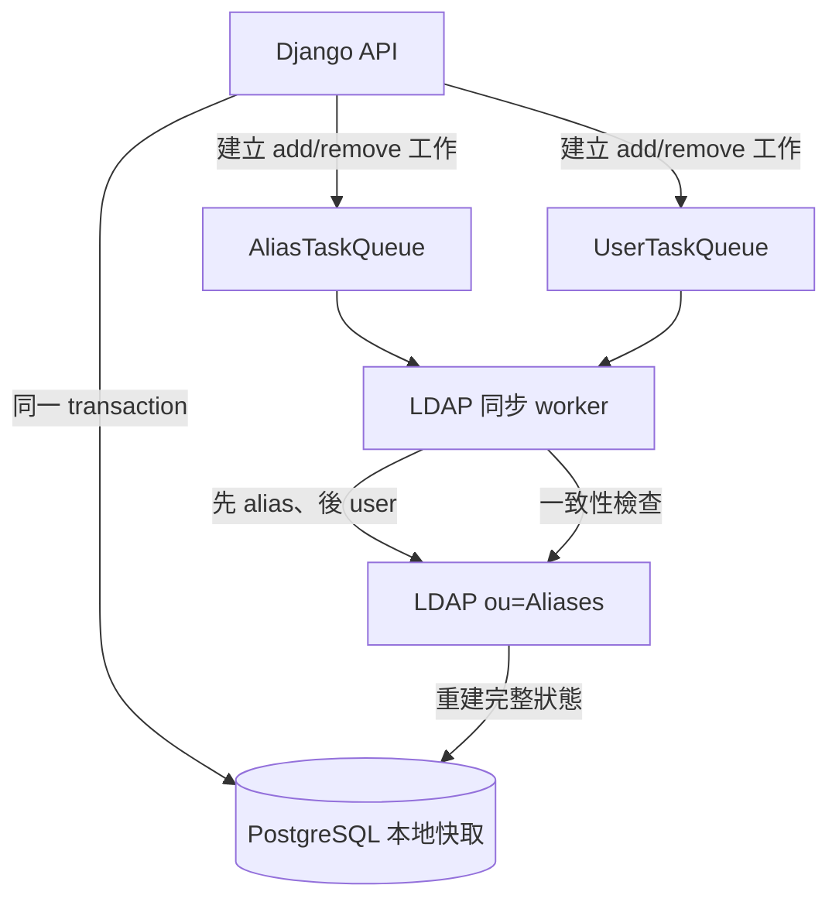
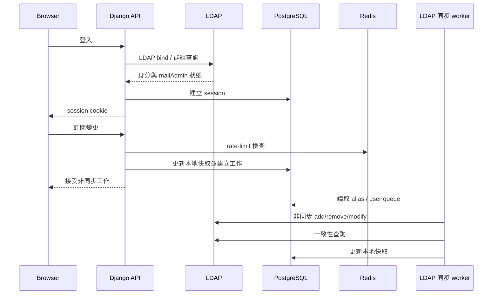

# 01 系統架構

## 系統邊界

系統由 React/Vite 前端、Django REST API、PostgreSQL、Redis、LDAP 同步 worker 與外部 LDAP 組成。Nginx、mail host、Postfix/Mailpit 與 LDAP 服務本身不在本 repository 的 Compose 配置內。

LDAP 是唯一真相來源：登入、使用者群組與 `ou=Aliases` 的 alias 成員狀態以 LDAP 為準。PostgreSQL 是本地快取與工作佇列，供 API 回應、Django session 及待處理變更使用。API 不直接寫入 LDAP；LDAP 寫入只由 ACTIVE 節點的 LDAP 同步 worker 非同步執行。

## 部署拓撲

Compose 的主要服務是 `postgres`、`redis`、`web`、`worker` 與 `frontend`。前端和 API 可由多個節點提供 HTTP；LDAP 寫入則預期只由 ACTIVE 節點的 LDAP 同步 worker 執行。

## 技術棧

| 層 | 技術 | 責任 |
|---|---|---|
| 前端 | React 19、Vite 8、Axios | 使用者與管理員介面 |
| API | Python 3.11、Django、Django REST Framework | session、權限、業務 API |
| 認證 | `django-auth-ldap` | LDAP bind 與 `mailAdmin` 群組映射 |
| 本地資料 | PostgreSQL 15 | 本地快取、Django session 與工作佇列 |
| Queue/cache | Redis 7 | Django-Q queue、rate-limit cache 與 flush lock |
| 背景工作 | Django-Q2 | LDAP 同步 worker 與一致性檢查 |
| LDAP client | `ldap3` | LDAP 同步 worker 對 LDAP 的讀寫與 TLS 驗證 |

## 資料與責任邊界

主要資料概念如下：

- `Alias` 保存 alias 名稱、顯示資訊與本地成員快取。
- `AliasTaskQueue` 保存 alias 建立或刪除工作。
- `UserTaskQueue` 保存成員加入或移除工作。
- LDAP `ou=Aliases` 的 entry 使用 `groupOfUniqueNames` 與 `uniqueMember` 表示實際 alias 成員。

PostgreSQL 本地快取不是 LDAP 的替代品。LDAP 同步 worker 完成佇列工作後再從 LDAP 讀取狀態，將本地快取校正為 LDAP 狀態。兩類工作分開排序，不能推論跨佇列的全域順序。

## 主要資料流

因此 API 成功接受訂閱或管理變更，不代表 LDAP 已立即完成寫入；實際完成由 LDAP 同步 worker 的排程與重試狀態決定。

## 業務規則

- alias 名稱只接受英數字與連字號，並作為本地識別鍵。
- 一般使用者只能管理自己的訂閱；`mailAdmin` LDAP 群組映射出的管理員可管理 alias 與成員。
- 所有 alias 與成員變更先寫入 PostgreSQL 本地快取與工作佇列，再由 LDAP 同步 worker 非同步同步 LDAP。
- LDAP 同步 worker 先處理 alias 工作，再處理成員工作，最後執行 LDAP 一致性檢查。
- LDAP operation 失敗時保留工作供下一次 flush 重試；PostgreSQL 工作佇列的順序不代表 LDAP 已完成的順序。
- LDAP bind、TLS 憑證驗證與使用者群組查詢是外部身份服務責任；本地 PostgreSQL 不取代這些查詢。

## 背景任務

Django-Q schedule 每 30 分鐘執行 `flush_ldap_tasks`，其流程是：

1. 處理 `AliasTaskQueue`。
2. 處理 `UserTaskQueue`。
3. 從 LDAP 重建或刪除 PostgreSQL 的 `Alias` 快取。

Redis lock 用來避免重疊 flush，但不是節點 fencing。失敗工作會保留在 queue；告警門檻與詳細處置屬於 [05 Migration](./05-migration.md) 的營運範圍。

## HA 設計與限制

選用的 HA 拓撲由多個 app host、monitor daemon、PostgreSQL dump/restore 同步與角色設定組成。monitor 依 peer 健康狀態、門檻與設定執行**最佳努力仲裁**，並將節點標記為 ACTIVE 或 standby；ACTIVE 節點才預期啟用 LDAP flush。

這不是共識系統，也沒有 quorum、distributed lease、epoch token 或外部 fencing：

- 網路分割時可能出現多個 ACTIVE，不能保證只有一個節點寫 LDAP。
- `FLUSH_ENABLED=0` 是設定 gate，不是 LDAP-side 強制限制；錯誤覆寫或 stale LDAP 同步 worker 仍可能造成寫入。
- Redis flush lock 只有 TTL，不能證明 lock owner 或節點仍是 ACTIVE。
- `db_sync.sh` 是 PostgreSQL dump/restore，不是 streaming replication，也不提供一致性快照或災難復原保證。
- 角色變更會重啟 web/worker；切換、同步與 fencing 仍需要外部維運流程。

因此 HA 提供的是依設定與 peer 可達性運作的最佳努力切換，不應被解讀為強一致或嚴格單一寫入者保證。設定與操作步驟請見 [03 建置與啟動](./03-setup.md)，API 與 schema 細節請見 [04 API 與資料庫](./04-api-and-db.md)。
